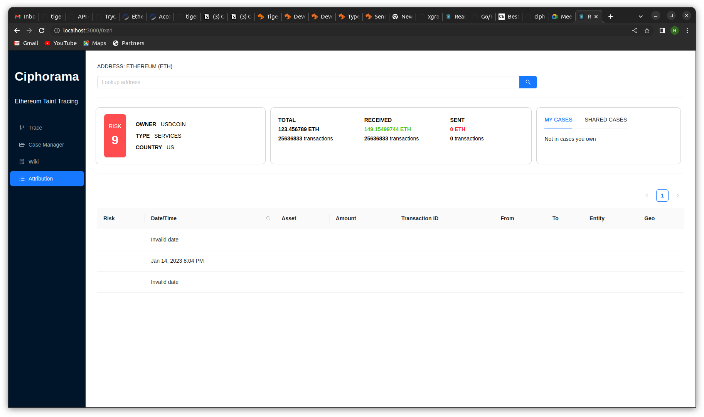

# Ciphorama Eth Taint UI

This project was bootstrapped with [Create React App](https://github.com/facebook/create-react-app).

In the project directory, you can run:
### `npm install` 
Installs all dependencies

### `npm start`

Runs the app in the development mode.\
Open [http://localhost:3000/0xa1](http://localhost:3000/0xa1) to view it in your browser.

The page will reload when you make changes.\
You may also see any lint errors in the console.



### `npm test`

Launches the test runner in the interactive watch mode.\
See the section about [running tests](https://facebook.github.io/create-react-app/docs/running-tests) for more information.

### `npm run build`

Builds the app for production to the `build` folder.\
It correctly bundles React in production mode and optimizes the build for the best performance.

The build is minified and the filenames include the hashes.\
Your app is ready to be deployed!

See the section about [deployment](https://facebook.github.io/create-react-app/docs/deployment) for more information.

### json-server mock 
```
sudo npm install -g json-server
json-server --watch mock-graph.json -p 3001
```
### Baackend Integration

use `k9s`, find the pod in namespace ciphorama-planner, shift-f to port forward 10000 to local.

`curl -X GET 'http://localhost:10000/v1/wallets?id=0x04786aada9deea2150deab7b3b8911c309f5ed90&graphName=eth_test'`
